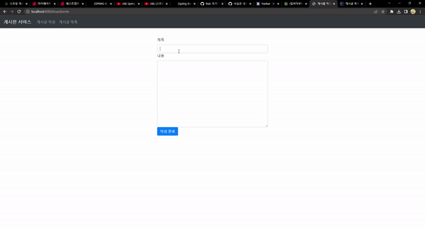

## 게시판 서비스

---

### 시연 영상

### 개발 환경
* 개발 도구 : Intellij IDEA Ultimate
* 개발 언어 : Java
* 프레임워크 : Spring Boot, MySQL
* 소스코드 관리 : Git

### 구현할 기능 목록
`12월 17일까지 구현 사항`
- [X] 게시물 작성 기능 (C) 
  - [X] 게시물 작성 완료 시 안내 메세지 띄우기
- [X] 게시물 리스트 페이지 구현 (R)  
    - [X] 게시물이 일정 개수 이상 넘어가면 일부분만 보이도록 하기 (페이징 기능)
- [X] 게시물 수정 (U)
  - [X] 게시물 수정 완료 시 안내 메세지 띄우기 
- [X] 게시물 삭제 (D)
                                     

`12월 22일까지 구현 사항`
- [X] 게시물 검색 기능
- [X] 게시물 총 건수 띄우기
- [X] 로그인 기능
  - [X] 로그인 , 로그아웃 버튼 생성
    - [X] 사용자가 로그인 상태일 때 로그아웃 버튼 보이기
    - [X] 사용자가 로그아웃 상태일 때 로그인 버튼 보이기
  - [X] 회원 테이블 생성
  - [X] 접근 권한 테이블 생성
  - [X] 로그인 페이지 생성
  - [X] 로그인 실패 시, 사용자에게 안내문 띄우기 (alert)
  - [X] 로그인 페이지와 회원 테이블 연동하기
- [X] 회원 가입 기능 
  - [X] 회원 테이블과 연동 
  - [X] 회원 가입 버튼 생성

### Board 테이블
* **id** (INT,PK,NN,AI) : 게시물의 고유 번호
* **title** (VARCHAR(45),NN) : 게시물의 제목
* **content** (TEXT,NN) : 게시물의 내용

### User 테이블
* **id** (INT,PK,NN,AI) : id의 고유 번호
* **username** (VARCHAR(45),NN,UQ) : 유저 id
* **password** (VARCHAR (100),NN) : 유저 password
* **enabled** (BIT,NN) : 유저의 활성화 유무

### Role 테이블 (Authorization)
* **id** (INT,PK,NN,AI) : id의 고유 번호
* **name** (VARCHAR(45),NN,UQ) : 권한명
